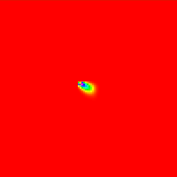
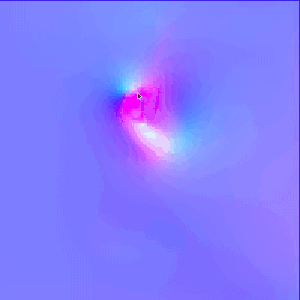

Euler fluid simulation
===

## Inspiration

This project is based upon an article by Mike Ash.

For more info see: https://mikeash.com/pyblog/fluid-simulation-for-dummies.html

## What is it?

This Project is a visualisation of the famous `Navier Stokes Equations`.

Simplified this project is a grid based simulation that emulates and visualizes how fluids act, as well as how their behaviour changes if you change the `viscosity` or `diffusion` of a certain liquid.

If you have any `improvements` or `ideas`, please let me know.

Also feel free to report any bugs that may occur.

## How to use

Pressing left mouse will add `density`.

Dragging the mouse will apply `force` towards the moving direction.

Keyboard options:
 - `c` = switch color mode (default, hsb, velocity)

## Building the project

To build the project simply execute `make build` in the directory of the `makefile`.

Make sure to also install the library `SFML` which is needed to build the project.

To install `SFML` under Linux: `sudo apt-get install libsfml-dev`
